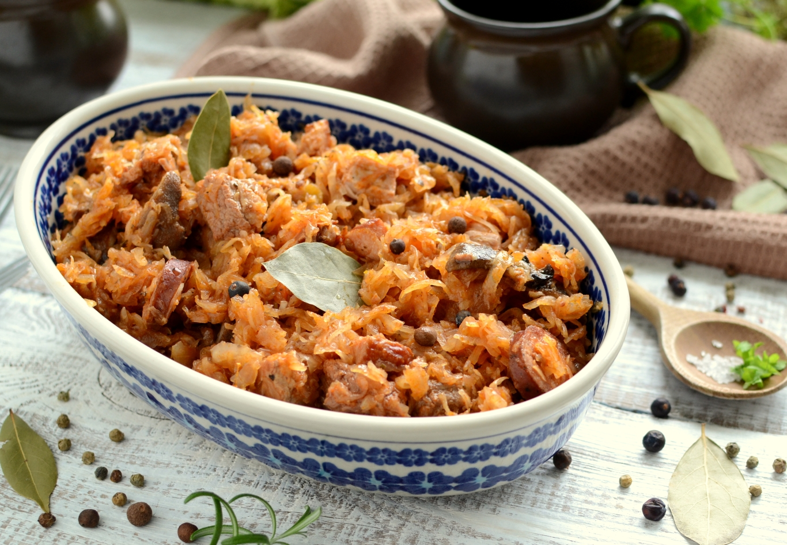

# Bigos

*Zobacz jak smakuje prawdziwy bigos tradycyjny. Poznaj mój sprawdzony przepis na bigos z dużą ilością różnych mięs, z suszonymi grzybami, śliwkami i idealnie dobranymi przyprawami. To danie, które Cię zachwyci.*

**składniki na bigos staropolski**

~~Czas przygotowania: 3 godziny~~
- Czas przygotowania: 2 godziny
- Czas duszenia: 2 dni
- Liczba porcji: 5 kg bigosu

>Kaloryczność kcal: 190 w 100 g bigosu
>>Dieta: bezglutenowa

Składniki:
1. 1 kg kapusty świeżej - pół średniej główki
2. 2 kg kapusty kiszonej + 2,5 szklanki wody do gotowania
3. 80 g suszonych grzybów + 500 ml wody do moczenia
4. 500 g łopatki wieprzowej
5. 300 g łopatki wołowej
6. 500 g boczku surowego bez skóry
7. 500 g schabu wieprzowego od karku
8. 50 g smalcu wieprzowego
9. 180 g kiełbasy myśliwskiej podwędzanej
10. 150 g boczku surowego wędzonego
11. 150 g boczku parzonego wędzonego
12. 2 duże cebule - do 400 g
13. 50 g suszonych śliwek bez pestek - lub więcej
14. 1 szklanka czerwonego, wytrawnego wina - można pominąć
15. przyprawy i zioła: 5 ziaren ziela angielskiego, łyżeczka czarnego pieprzu, 5 liści laurowych, 1 goździk, 2 ziarna jałowca
```py 
print("Przepyszny bigosik")
print("Taki nie za tani, ale drogi też nie")
print("Życzę smacznego")
```
Jeśli smakowało to możemy użyć polecenia ``print("Było przepyszne")``
Bigos
